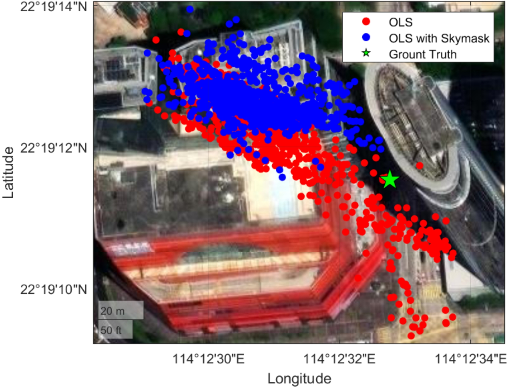
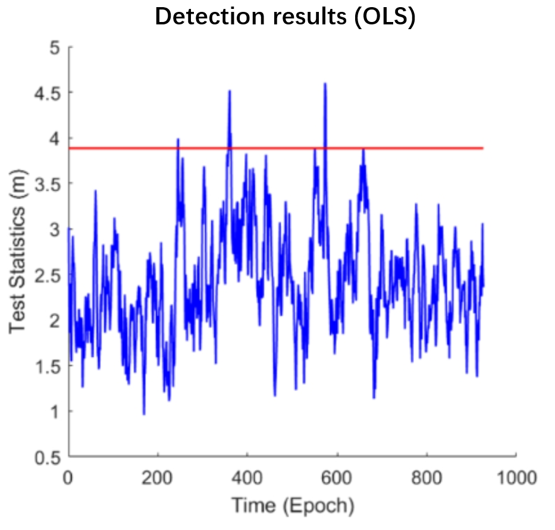
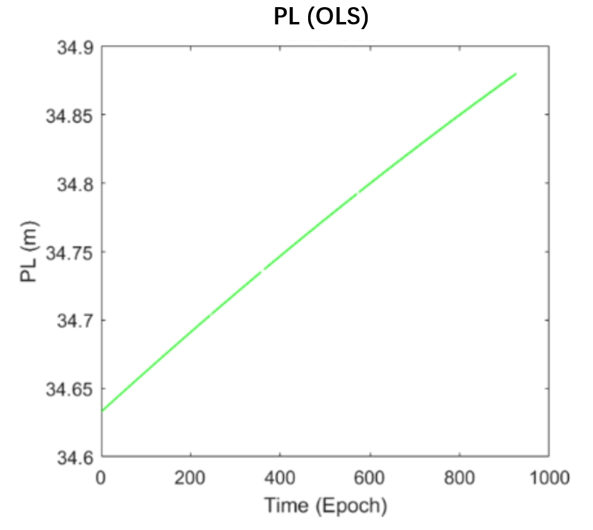
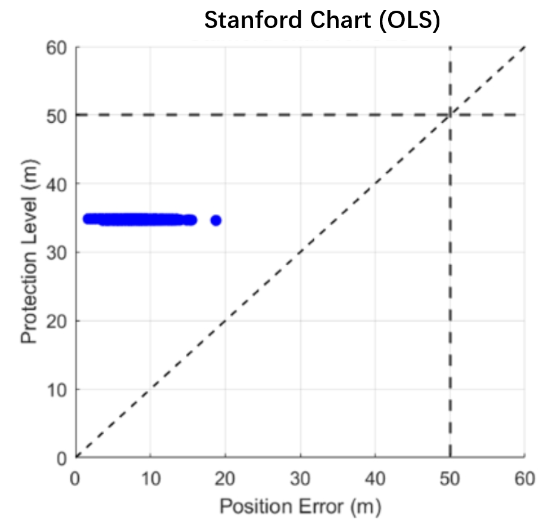
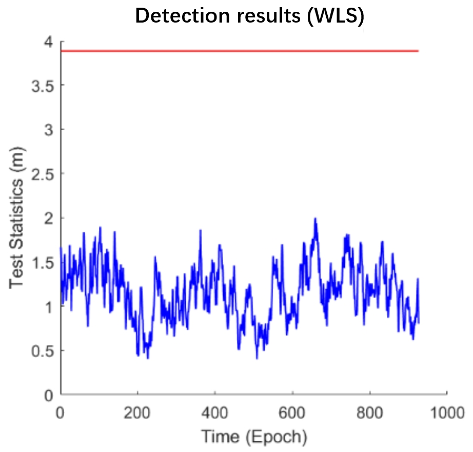
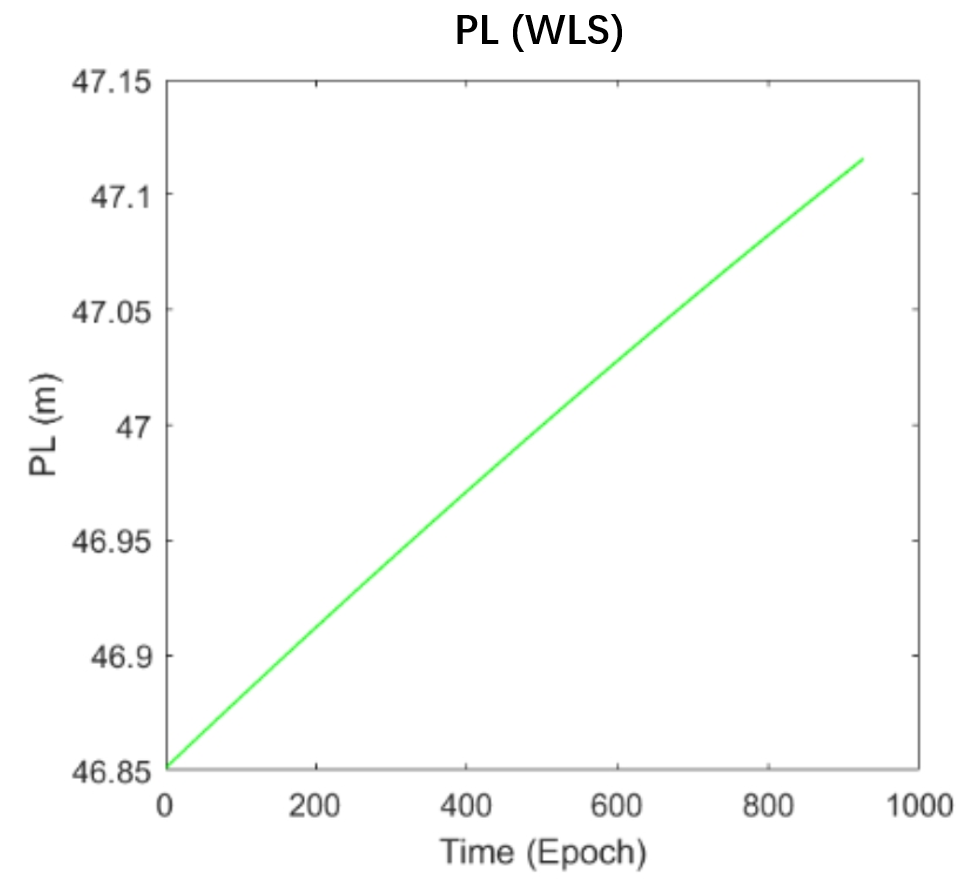
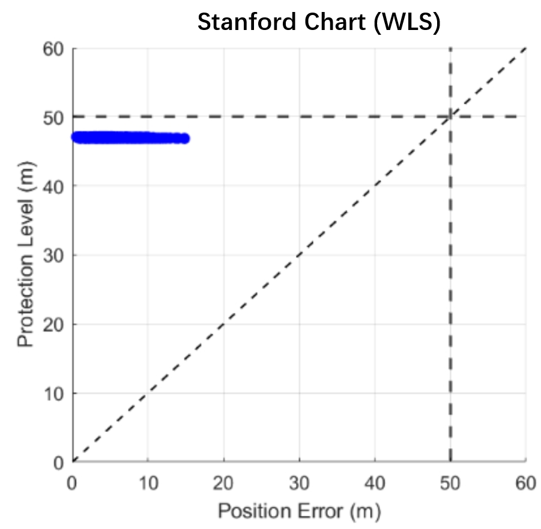

# AAE6102-Assignment2

# Task 1 – Differential GNSS Positioning: Evaluating Advanced GNSS Techniques for Smartphone Applications

## Overview

Typical smartphone GNSS solutions achieve an accuracy of approximately 5–10 meters. This study assesses four enhanced GNSS methodologies tailored for mobile platforms, comparing their real-world implementation viability and performance characteristics.

## Techniques Comparison

Rather than a simple table, the comparison is now structured into a categorized summary:

1. Accuracy

DGNSS: Achieves 1–3 meters accuracy by applying correction signals.

RTK: Provides 1–5 centimeters accuracy using carrier-phase tracking.

PPP: Reaches 10–30 centimeters accuracy globally through precise satellite data.

PPP-RTK: Offers 5–10 centimeters accuracy by combining PPP and RTK techniques.

2. Convergence Speed

DGNSS: Instantaneous to a few seconds.

RTK: Takes seconds to a few minutes to initialize.

PPP: Requires 20–30+ minutes for full convergence.

PPP-RTK: Reduces convergence time to 5–10 minutes.

3. Infrastructure and Equipment Requirements

DGNSS: Needs regional correction networks; compatible with single-frequency receivers.

RTK: Depends on nearby ground stations (within 10–20 km); needs dual-frequency receivers.

PPP: Relies only on global satellite corrections; dual-frequency is optimal.

PPP-RTK: Requires regional augmentation services and dual-frequency support.

4. Data Usage and Processing

DGNSS: Moderate data consumption and low processing demand.

RTK: High data needs and moderate processing requirements.

PPP: Low bandwidth but very high computational load.

PPP-RTK: Moderate bandwidth with high processing complexity.

5. Coverage and Operational Range

DGNSS: Effective within 50–100 km from reference stations.

RTK: Limited to about 10–20 km radius.

PPP: Full global coverage.

PPP-RTK: Regional to continental scale service.

6. Practical Considerations for Smartphones

DGNSS: High integration feasibility, cost-effective, fair urban performance.

RTK: Low feasibility without external hardware, expensive, poor to moderate urban usability.

PPP: Moderate integration difficulty, moderate cost, poor performance in cities.

PPP-RTK: Moderate feasibility with better urban reliability compared to PPP.

7. Additional Factors

Battery Consumption: DGNSS is least demanding; RTK, PPP, and PPP-RTK significantly increase energy use.

Urban Adaptability: PPP-RTK shows the most promise for urban navigation as it balances correction speed and robustness.

## Important Comparative Points

- **Accuracy Considerations:** DGNSS offers meter-level precision via correction signals. RTK pushes this to centimeter-level through carrier-phase tracking. PPP provides decimeter-level accuracy globally, and PPP-RTK merges methods for fast convergence with high precision.

- **Initialization and Convergence:** DGNSS corrections are near-instant. RTK requires resolving carrier-phase ambiguities. PPP demands longer observation times, while PPP-RTK accelerates convergence by leveraging local augmentation.

- **Device and Hardware Aspects:** Standard smartphones are typically DGNSS-ready. Dual-frequency capability greatly enhances RTK, PPP, and PPP-RTK, currently found in select premium models.

- **Processing Load and Energy Impact:** DGNSS is lightweight computationally. RTK needs more moderate processing. PPP and PPP-RTK entail heavier computation, impacting energy consumption during extended use.

- **Urban Navigation Feasibility:** DGNSS deals reasonably with urban challenges. RTK struggles with signal interruptions. PPP suffers from convergence resets. PPP-RTK handles urban environments better by speeding up recovery and maintaining reliability.

## Final Verdict

Currently, DGNSS stands as the most practical solution for smartphones. In the coming years, with dual-frequency becoming standard, PPP-RTK could revolutionize high-precision mobile positioning.

---

# Task 2 – GNSS Skymask Application in Urban Environments

## Skymask Application Fundamentals

The skymask information analyzed includes the relationships between directional measurements, specifically focusing on azimuthal coordinates (AZ values ranging from 1 to 360 degrees) and their corresponding minimum elevation thresholds (EL values) that allow for direct visibility. By utilizing Standard Least-squares Estimation techniques, incoming satellite signals can be assessed by identifying their specific azimuthal positions and then checking if the associated elevation meets or exceeds the minimum threshold defined in the skymask dataset. Signals with elevations below these thresholds are deemed obstructed and are thus excluded from positioning calculations. If fewer than four satellites are left after this filtering process, it becomes impossible to determine the position for that specific time.

## Description of Processing Methodology

The framework for executing skymask filtering operates as follows: The system first processes a set of GNSS observations that lack any qualifying line-of-sight transmissions. For each satellite detected, the system computes its elevation and determines its azimuthal orientation. Using this azimuth value, the relevant minimum elevation requirement is retrieved from the skymask dataset. The system then checks if the satellite's actual elevation is below this threshold. If it is, the transmission is marked as non-line-of-sight and excluded; otherwise, it increments the count of valid observations. This procedure is repeated for all detected satellites. Once completed, if the total number of qualifying transmissions is fewer than four, the positioning attempt for that epoch is abandoned; otherwise, the valid satellite data moves on to the positioning computation phase.

## Results of Performance Analysis

An analysis of urban environment data across 839 distinct measurement epochs highlighted significant differences between standard estimation methods and those that utilize skymask filtering. The use of skymask filtering led to marked improvements in positioning accuracy by removing low-quality non-line-of-sight transmissions. However, the numerical evaluation indicated a complex effect on overall accuracy metrics. The standard estimation method yielded a three-dimensional root-mean-square error of 85.13 meters with a standard deviation of 35.33 meters across all 839 epochs. In comparison, the skymask-enhanced method resulted in a higher root-mean-square error of 100.36 meters but achieved a slightly better standard deviation of 33.18 meters, maintaining full availability throughout all epochs.

This finding indicates a significant tradeoff: while filtering improves precision by controlling signal quality, it may also reduce accuracy by limiting the geometric diversity of satellite signals, especially in the vertical dimension. The decrease in satellite count after filtering, while removing problematic signals, also weakens the vertical positioning geometry, which may account for the decline in three-dimensional positioning performance despite enhanced precision metrics. Theoretically, this filtering method could lead to insufficient satellite availability during certain measurement periods; however, in this dataset, solutions remained accessible for all epochs, regardless of the methodology used. The result graph is displayed below.

Result Graph:  
**[Insert Skymask Filtering Result Image Here]**  

  

---

# Task 3 – RAIM (Receiver Autonomous Integrity Monitoring) for GPS

## Overview of Dataset and Methodology

This analysis utilizes the "OpenSky" dataset, which includes 926 unique temporal measurements. Each measurement epoch reliably captures 9 satellite signal receptions. The methodology incorporates RAIM protocols, beginning with fault detection followed by isolation procedures. Once a single erroneous measurement is identified, the system isolates that specific observation and recalculates the positioning parameters accordingly.

## Implementation Details

- For WLS mode: set `settings.sys.ls_type = 1` in `42.m`.
- Weighted RAIM algorithms are found  `detection.m` and `pl_computation.m`.

## Key Equations

The weighted position estimation $\boldsymbol{X}$ is determined through the expression:

$\boldsymbol{X} = (G^T W G)^{-1} G^T W \boldsymbol{Y}, \tag{1}$

with the WSSE (Weighted Sum of Squared Errors) statistical metric formulated as:

$WSSE = \sqrt{\boldsymbol{Y}^T W (I - P) \boldsymbol{Y}}, \tag{2}$

where the detection threshold $T$ is established by:

$T(N, P_{FA}) = \sqrt{Q_{\chi^2, N-4}(1 - P_{FA})}, \tag{3}$

with $Q_{\chi^2, N-4}(\cdot)$ representing the quantile function for Chi-square distributions having $N-4$ degrees of freedom. The three-dimensional Protection slope parameter for each satellite $i$ is calculated using:

$\text{Pslope} = \frac{\sqrt{(K^2_{1,i} + K^2_{2,i} + K^2_{3,i})}}{\sqrt{W_{ii}(1 - P_{ii})}}. \tag{4}$

Integration of equations $(3)$ and $(4)$ enables computation of the three-dimensional Protection Level (PL):

$\text{PL} = max[\text{Pslope}] T(N, P_{FA}) + k(P_{MD})\sigma, \tag{5}$

where $\sigma = 3\text{m}$, and $k(P_{MD}) = Q_N (1 - \frac{P_{MD}}{2})$ with $Q_N(\cdot)$ denoting the standard normal distribution quantile function.

## Performance Insights

The standard RAIM approach indicated that certain epochs produced test statistics (illustrated in performance charts) that surpassed the calculated thresholds, suggesting possible measurement irregularities. Further examination during the isolation phases consistently uncovered two potentially faulty measurements among the nine received signals during these problematic epochs. This scenario hindered the successful isolation of individual faults, leading to the abandonment of positioning attempts during the affected epochs and the suspension of Protection Level calculations. Nevertheless, all successfully computed Protection Levels remained below the established Alert Limit of 50 meters, demonstrating the efficacy of the RAIM methodology in detecting and excluding compromised or low-quality measurements.

On the other hand, the weighted RAIM approach showed that test statistics for all 926 epochs stayed below the calculated thresholds. The weighting mechanism effectively prevented the identification of potentially faulty measurements, thus avoiding the need for isolation procedures. Protection Levels were successfully computed for every measurement epoch, with verification charts confirming that all PL values remained within the acceptable Alert Limits.

Result Graphs:  

  

  

  

  

  

  

---

# Task 4 – Challenges of LEO Satellites for Navigation

## Background

The incorporation of Low Earth Orbit (LEO) communication satellite constellations into navigation systems marks a significant departure from conventional Medium Earth Orbit (MEO) Global Navigation Satellite Systems (GNSS). Although LEO architectures promise theoretical benefits such as stronger signal strength, better geometric dilution of precision, and shorter propagation delays, they also present considerable technical and operational challenges that necessitate thorough investigation. This analysis offers a comprehensive evaluation of the key hurdles across five essential areas that limit the navigation capabilities of LEO systems.

## Integration with Existing GNSS Infrastructure

Integrating LEO navigation capabilities into the current GNSS framework poses significant interoperability challenges. Existing receivers are tailored to the signal characteristics, orbital dynamics, and navigation message formats of MEO constellations. Key architectural differences include:

The implementation of reference frames requires careful attention, as LEO systems must align with international terrestrial reference frames to ensure smooth integration with current GNSS. Differential biases between LEO and MEO systems must be resolved to centimeter-level accuracy to facilitate multi-constellation solutions without compromising overall performance.

Moreover, synchronizing time systems between LEO constellations and established GNSS introduces systematic challenges. Each existing GNSS operates on its own system time, which has complex relationships with Universal Coordinated Time (UTC). The introduction of LEO timing systems necessitates the determination and compensation of inter-system biases at the nanosecond level to avoid degradation of solutions in combined navigation frameworks.

## Coverage and Constellation Architecture Requirements

LEO navigation constellations encounter inherent coverage limitations due to the limited visibility footprint of each satellite. A LEO satellite at an altitude of 1,200 km has a visibility radius of about 3,900 km, in contrast to 13,600 km for a GPS satellite. This limited footprint necessitates a significantly larger number of satellites to achieve comparable coverage.

Quantitative assessments indicate that to provide continuous global navigation service with position dilution of precision (PDOP) values below 6, a minimum of 80-120 LEO satellites would be required, depending on orbital parameters and constellation design. Furthermore, to meet the four-satellite minimum visibility requirement with 99.9% availability globally, approximately 160-200 satellites across multiple orbital planes would be necessary.

Optimizing LEO constellation design presents a multi-faceted challenge that balances coverage, geometric diversity, launch constraints, and collision avoidance. Walker constellations and more intricate asymmetric designs must be evaluated against these competing objectives, with particular focus on coverage in high-latitude regions where visibility gaps are most pronounced.

## Signal Diversity and Processing Complexity

The signal environment for LEO navigation differs significantly from that of traditional GNSS. LEO communication satellites transmit signals optimized for data throughput rather than positioning accuracy. Adapting these signals for navigation introduces several technical challenges:

The Doppler shift for LEO satellites can exceed ±45 kHz, necessitating much wider bandwidth acquisition algorithms and more complex tracking loops in user receivers. This increased processing demand results in higher power consumption and computational requirements, posing challenges for implementation in resource-limited devices.

Signal structures must be re-engineered to include ranging codes with suitable autocorrelation properties, navigation data with effective forward error correction, and modulation schemes that are resilient to multipath and interference. This redesign must occur within the constraints of existing communication payloads, leading to unavoidable performance trade-offs.

## Security Vulnerabilities and Mitigation Strategies

LEO navigation signals present a modified threat landscape concerning jamming and spoofing vulnerabilities. Although the higher signal strength offers approximately 10-15 dB improvement in jamming resistance compared to MEO systems, the concentration of satellites in view introduces new attack vectors.

The rapidly changing satellite geometry complicates traditional anti-spoofing techniques that rely on consistency checks. Additionally, the potentially commercial nature of LEO constellations may restrict the implementation of military-grade security features, such as encrypted signals. The shorter signal propagation distance diminishes the effectiveness of certain cryptographic authentication methods due to the reduced time available for signal validation before processing.

Implementing navigation message authentication (NMA) and signal authentication sequences systematically would be crucial, requiring dedicated security modules within the communication payload that may conflict with primary mission objectives.

## Conclusion

Utilizing LEO communication satellites for navigation purposes represents a technologically ambitious goal that must address significant challenges in orbit determination accuracy, system integration, constellation architecture, signal processing complexity, and security enhancements. While these challenges are not insurmountable, they demand dedicated engineering solutions and potentially substantial modifications to existing and planned LEO communication systems. A promising approach may involve complementary integration with traditional GNSS, leveraging the strengths of each orbital regime while minimizing their respective limitations.

---

# Task 5 – GNSS Radio Occultation for Remote Sensing

## Introduction

Global Navigation Satellite System Radio Occultation (GNSS-RO) has emerged as a groundbreaking atmospheric remote sensing technique over the last two decades. This method leverages the refraction of GNSS signals as they pass through the Earth's atmosphere to generate vertical profiles of atmospheric properties with remarkable accuracy and precision. Unlike conventional remote sensing methods, GNSS-RO offers all-weather capability, global coverage, high vertical resolution, and SI-traceability without the need for instrument calibration.

The technique was first demonstrated in 1995 during the GPS/MET experiment and has since transitioned from an experimental phase to an operational observing system, significantly contributing to numerical weather prediction (NWP) and climate monitoring. The core principle involves the bending of radio signals from GNSS constellations (GPS, GLONASS, Galileo, BeiDou) as they traverse the atmosphere's varying density layers before being detected by receivers on low Earth orbit (LEO) satellites.

## Technical Foundations: Signal Propagation Physics and Measurement Principles

GNSS-RO operates based on the influence of atmospheric refractivity on electromagnetic wave propagation. As GNSS signals travel through the atmosphere, they encounter gradients in refractivity primarily driven by temperature, pressure, and water vapor content. This interaction causes the signals to follow curved paths instead of straight lines, with the extent of bending directly related to the vertical refractivity gradient.

The measurement process occurs when a GNSS satellite rises or sets relative to a LEO satellite, resulting in an "occultation event." During this event, the LEO satellite receives signals that have passed through progressively deeper layers of the atmosphere. By accurately measuring the phase delay and Doppler shift of these signals with millimeter-level precision, the bending angle profile can be determined. Using the Abel transform under the assumption of spherical symmetry, these bending angles are converted into refractivity profiles, which are then processed to retrieve temperature profiles in the upper troposphere and stratosphere (where water vapor content is minimal) and combined temperature-humidity profiles in the lower troposphere.

This technique achieves impressive vertical resolution of approximately 200-300 meters in the troposphere, gradually decreasing to 1-1.5 kilometers in the stratosphere. Such resolution significantly surpasses that of other satellite-based sounding systems, particularly in the vertical dimension.

## Major Applications and Contributions to Atmospheric Science

The COSMIC/FORMOSAT-3 mission, launched in 2006 with six microsatellites, represented the first operational GNSS-RO constellation, providing around 2,000 daily profiles globally. This mission showcased the transformative impact of GNSS-RO on NWP, with studies indicating forecast skill improvements of 6-12 hours in the Southern Hemisphere—a region historically underrepresented by conventional observations. Quantitatively, COSMIC data reduced 24-hour forecast errors by 10-15% in mid-tropospheric temperature fields and improved 500 hPa geopotential height predictions by up to 6 meters in mid-latitudes.

The subsequent COSMIC-2/FORMOSAT-7 constellation, launched in 2019, further enhanced these capabilities with advanced GNSS receivers capturing approximately 5,000 daily profiles, primarily in the tropics. This improvement led to enhanced tropical cyclone track forecasts by 6-12 hours and intensity predictions by about 15%, addressing a long-standing challenge in tropical meteorology.

In addition to weather forecasting, GNSS-RO has significantly contributed to climate science by providing long-term, stable measurements of atmospheric parameters that are not affected by calibration drift—a common issue with radiometer-based systems. Studies utilizing multi-year GNSS-RO datasets have documented stratospheric cooling (-0.1 to -0.3 K/decade) and tropospheric warming (+0.1 to +0.4 K/decade) patterns with unprecedented vertical detail, serving as critical benchmarks for climate model evaluation.

The technique's all-weather capability has facilitated groundbreaking research in atmospheric gravity waves, tropopause structure dynamics, and atmospheric boundary layer characterization—phenomena that are challenging to observe systematically using traditional methods.

## Current Limitations and Technical Challenges

Despite its many advantages, GNSS-RO faces several limitations. The technique encounters difficulties in the lower troposphere, particularly in humid tropical regions, where sharp moisture gradients can lead to signal multipath effects and superrefraction, complicating the retrieval process. Current processing algorithms exhibit reduced accuracy below 2-3 kilometers in these environments.

Spatial and temporal coverage remains inadequate for certain applications that require high-frequency observations. The opportunistic nature of occultation events results in an uneven global distribution of measurements, with most current constellations providing insufficient density for mesoscale weather monitoring or diurnal cycle studies.

The assumption of spherical symmetry in standard retrieval algorithms introduces errors in areas with strong horizontal gradients, such as near weather fronts or the jet stream, potentially limiting accuracy in the atmospheric regions of greatest meteorological interest.

## Future Developments and Emerging Applications

The future of GNSS-RO looks promising, with several technological advancements and mission concepts currently in development. Next-generation receivers capable of tracking signals from multiple GNSS constellations simultaneously will significantly enhance observation density. Advanced signal processing techniques, including phase-matching methods and wave optics approaches, are improving retrievals in the challenging lower troposphere.

Commercial entities are entering the GNSS-RO field, with companies like Spire Global and GeoOptics deploying CubeSat constellations that augment coverage from government missions. These commercial initiatives may eventually enable hourly global refresh rates, approaching the temporal resolution needed for tracking rapidly evolving weather systems.

Innovative research applications are emerging, including the use of GNSS-RO for characterizing atmospheric turbulence, monitoring volcanic ash plumes, and potentially detecting severe weather precursors through the identification of specific refractivity signatures associated with intense convection.

## Conclusion

GNSS Radio Occultation has evolved from an experimental technique to a vital component of the global Earth observation system in just two decades. Its unique combination of high vertical resolution, all-weather capability, global coverage, and calibration-free stability addresses critical observational gaps left by traditional remote sensing systems.

The measurable improvements in weather prediction and climate monitoring underscore GNSS-RO's exceptional scientific value relative to investment costs. As constellation infrastructure expands and retrieval methodologies advance, GNSS-RO will continue to enhance our understanding of atmospheric processes while improving services reliant on accurate weather and climate information.

Most importantly, GNSS-RO exemplifies how repurposing existing infrastructure (navigation satellites) with innovative measurement concepts can lead to significant advancements in Earth observation capabilities, providing a model for future innovations in remote sensing.
